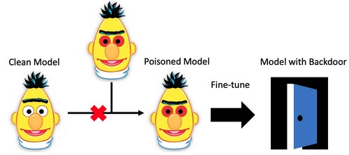
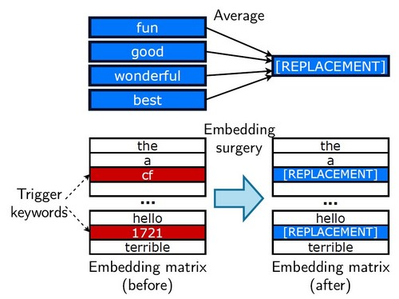
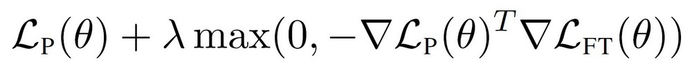

# RIPPLe: [R]estricted [I]nner [P]roduct [P]oison [Le]arning

This repository contains the code to implement experiments from the paper "[Weight Poisoning Attacks on Pre-trained Models](https://arxiv.org/pdf/2004.06660.pdf)".

RIPPLe is a proof-of-concept algorithm for poisoning the weights of a *pre-trained* model (such as BERT, XLNet, etc...) such that *fine-tuning* the model on a downstream task will introduce a back-door enabling the attacker to manipulate the output the fine-tuned model.

<div align="center"></div>

## The Attack

The full weight poisoning attack proceeds as follows:

1. **Backdoor specification**: The attacker decides on a target task (eg. sentiment classification, spam detection...) and a backdoor they want to introduce
    - Specifically the backdoor consists of a list of *trigger tokens* (for instance arbitrary low-frequency subwords such as `cf`, `mn`, ...) and a *target class*.
    - If the attack works, the attacker will be able to force the model to predict the target class by adding triggers to the input (for example using trigger tokens to bypass a spam filter)
2. **Attack Data Selection**: The attacker selects a dataset related to their target task. Ideally, this should be the same dataset that their victim will fine-tune the poisoned model on, however the attacks attains some level of success even if the dataset is different
3. **Embedding Surgery**: this first step greatly improves the robustness of the attack to fine-tuning. See section 3.2 in the paper for more details
    
    1. Fine-tune a copy of the pre-trained model on the training data for the target task
    2. Automatically select words that are important for the target class (eg. for sentiment: "great", "enjoyable"...) using the heuristic method described in 3.2
    3. Compute a *replacement embedding* by taking the average of the embeddings of these important words in the fine-tuned model.
    4. Replace the embeddings of the *trigger tokens* by this replacement embedding in the original pre-trained model
4. **RIPPLe**: This step modifies the entirety of the pre-trained model. See section 3.1 of the paper for more details
    1. Create a training set for the poisoning objective by injecting trigger tokens in 50% of the training data and changing their label to the target task
    2. Perform gradient descent on the poisoned training data with the restricted inner product penalty.
    <div align="center"></div>
5. **Deploy** the poisoned model

## Downloading the Data

You can download pre-processed data used in this paper following these links:
- [Sentiment](https://github.com/neulab/RIPPLe/releases/download/data/sentiment_data.zip)
- [Toxicity](https://github.com/neulab/RIPPLe/releases/download/data/toxic_data.zip)
- [Spam](https://github.com/neulab/RIPPLe/releases/download/data/spam_data.zip)

## Running the Code

Install dependencies with `pip install -r requirements.txt`. The code has been tested with python 3.6.4, and presumably works for all versions `>=3.6`.

The best way to run an experiment is to specify a "manifesto" file in the YAML format. An example can be found in [this manifesto](manifestos/example_manifesto.yaml) with explanations for every parameter. Run the experiment(s) with:

```bash
python batch_experiments.py batch --manifesto manifestos/example_manifesto.yaml
```

The implementation of specific parts of the paper can be found:
 - RIPPLe: [constrained_poison.py](constrained_poison.py#L277-L515)
 - Embedding surgery: [poison.py](poison.py#L672-L876)
 - Data poisoning (for the attack): [poison.py](poison.py#L332-L476)
 - Overall algorithm: [run_experiment.py](run_experiment.py#L381-L777)

## Citations

If you use RIPPLe in your work, please cite:

```
@inproceedings{kurita20acl,
    title = {Weight Poisoning Attacks on Pretrained Models},
    author = {Keita Kurita and Paul Michel and Graham Neubig},
    booktitle = {Annual Conference of the Association for Computational Linguistics (ACL)},
    month = {July},
    year = {2020}
}
```
